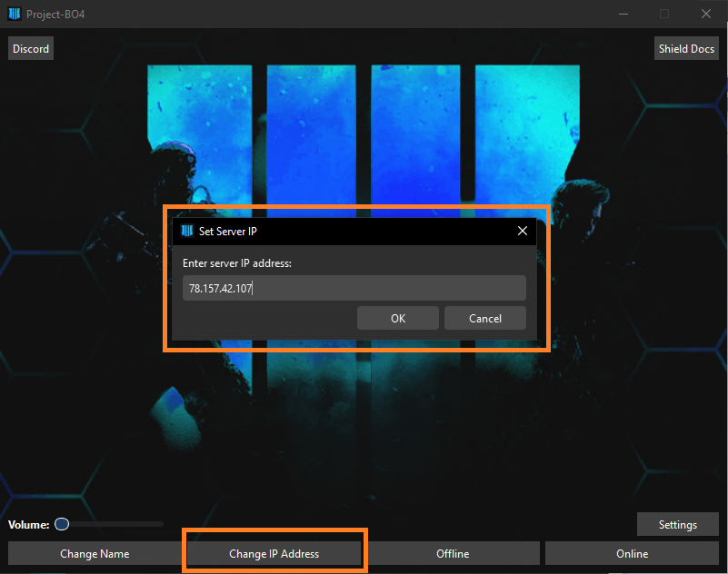

# Connecting To A Server

Using the launcher select `Change IP Address`

Enter the IP of choice and press `OK`

<figure><figcaption></figcaption></figure>

Then press `Online`

***

## Connect To A Server Manually

Open the file `project-bo4.json` in your Black ops 4 installation directory, At the lines:

```
"demonware": {
    "ipv4": "127.0.0.1",
    "serverlist": "127.0.0.1:8080"
},
```

Replace `"127.0.0.1"` or whatever value you have with the server IP address.
