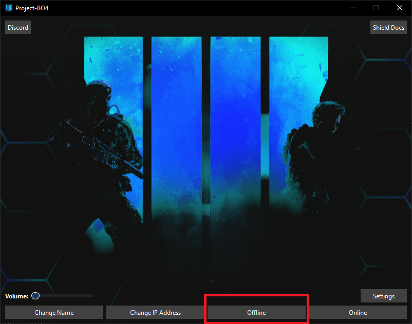
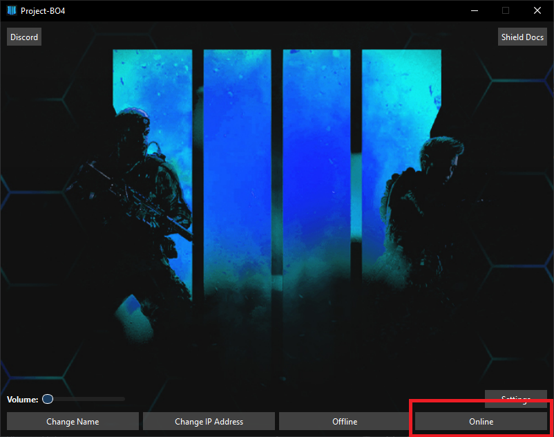

# How To Play

### How to play

### Playing Offline

Using the launcher select `Offline`

<figure><figcaption></figcaption></figure>

This will put you in a fully offline mode.

## Playing Online

Enter the IP of the server in `Change IP Address`. [connecting-to-a-server.md](connecting-to-a-server.md "mention")

<figure><figcaption></figcaption></figure>

Using the launcher select `Online`

<figure><figcaption></figcaption></figure>

We host public servers in our [Discord](https://discord.gg/AXECAzJJGU).

This mode will allow you to play with friends providing you setup and connect to a working server.
