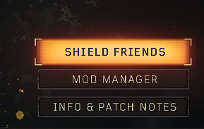

# How To Connect With Friends

There is two ways to play with friends or randoms, by using the server browser in main menu or shield friends. 

* **First way: Lobby Browser**\
  Using Lobby Browser (in server browser menu, FOR PUBLIC MATCHES!):\
  If you want to host a match, go to any gamemode and press Public Match/Find Match button, for example in zombies:\
  .png>)\
  If you want to join a match, then you can go to lobby browser to browse the available hosted matches\
  \
   
* **Second way: Shield Friends**\
  Using Shield Friends (FOR PRIVATE MATCHES/CUSTOM GAMES!):\
  \
  \
  First open the menu, then add your friend in the text box here (by username):\
  .png>)\
  \
  Wait for your friend to accept the friend request (he can do it in the same menu), then he can join you by right clicking on your profile in the shield friends menu. this will also create a shield party for you and the friend automatically.
